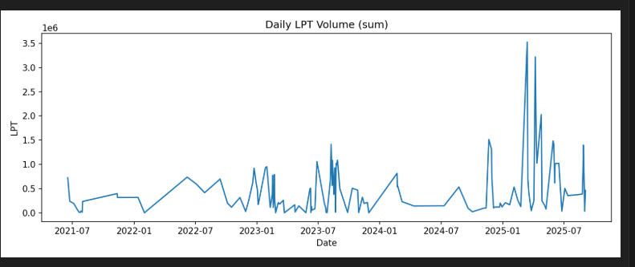

# Crypto AI Analytics – Livepeer (LPT) On-Chain Data

## 📌 Description
This project aims to analyze on-chain flows related to the **Livepeer (LPT)** token in order to detect early signals of **buying/selling pressure** and their potential impact on price.

## 📂 Included Dataset
### `data/lpt_transfers_binance_hotwallet20.csv`
Extract of **LPT ERC-20 transfers** for the address **Binance Hot Wallet 20**  
`0xF977814e90dA44bFA03b6295A0616a897441aceC`

#### Columns:
- `hash` → unique transaction identifier  
- `blockNumber` → Ethereum block number  
- `timeStamp` → UNIX timestamp (in seconds)  
- `from` → sender address  
- `to` → recipient address  
- `value_LPT` → transferred amount in LPT (normalized to human-readable units)

#### Example:
| hash | blockNumber | timeStamp | from | to | value_LPT |
|------|-------------|-----------|------|----|-----------|
| 0x0056...c676 | 12650622 | 1623915020 | 0x28c6...21d60 | 0xf977...1acec | 476,851.50 |

---

## 🔎 Quick Analysis
- The observed volumes (250k to 476k LPT) correspond to **internal CEX movements**, typical of **liquidity rebalancing**.  
- Large inflows of LPT into Binance can be interpreted as a **sell pressure signal** (tokens being prepared for sale).  
- Conversely, large outflows from CEX to private wallets/orchestrators often indicate an **accumulation phase**.  
- Monitoring these flows acts as an **early volatility indicator**, complementing market metrics (open interest, funding rate, spot price).

---

## 🗺️ Roadmap (Day by Day)

> **Day 1 completed in one morning** 🚀 (setup + first dataset)

**Day 1 – Setup & First Dataset (1 morning)**  
- Installed Python + pip, verified environment on Windows PowerShell.  
- Created GitHub repo `crypto-ai-analytics` and configured Git (username/email, PAT).  
- Built a minimal script to fetch **LPT transfers** via Etherscan:  
  - `scripts/get_lpt_transfers.py`  
  - Output sample: `data/lpt_transfers_binance_hotwallet20.csv`  
- Wrote the first README in English and pushed everything to GitHub.  

**Day 2 – Packaging & Query Options**  
- Add CLI options to filter by date/block range.  
- Add basic logging + error handling.  
- Save both CSV and a quick summary (`docs/summary_day2.md`).  

**Day 3 – Scheduling & More Exchanges**  
- Add addresses for **Kraken, Coinbase, Gate** and export their datasets to `/data`.  
- Windows Task Scheduler job that runs daily.  
- Commit: “feat: daily batch for CEX inflows”.  

**Day 4 – Orchestrators (Top-20)**  
- Pull Top-20 orchestrators from The Graph Gateway.  
- Store a daily snapshot (`data/livepeer_top20_orchestrators_YYYY-MM-DD.csv`).  
- Commit: “feat: top20 snapshot via GraphQL”.  

**Day 5 – Unbond Monitoring**  
- Collect `Unbond` events for Top-20 (ETH only) and aggregate daily.  
- Export charts (PNG) and a CSV with 7-day shift + anomaly flags.  
- Commit: “feat: unbond daily with anomalies”.  

**Day 6 – Market Metrics Integration**  
- Fetch Open Interest & Funding Rate (Coinglass) for LPT (if available).  
- Merge with on-chain flows → correlation sketches.  
- Commit: “feat: merge flows + market metrics”.  

**Day 7 – Weekly Report**  
- Generate a simple weekly report (Markdown + PNG charts in `/docs`).  
- Post a short thread on findings (to be linked here).  
- Commit: “docs: weekly report v1”.  

------

## 📊 Visualization Example

Daily LPT transfer volumes (sum per day) — extracted from Binance Hot Wallet 20:

*Interpretation*:  
We can clearly see **periods of high spikes** in LPT transfers (notably in early 2025), which may correspond to **CEX liquidity moves or selling pressure events**.

## 🎓 Educational Note
This project is developed as part of an **intensive training program in blockchain & AI engineering applied to crypto trading**.  
It documents my progress step by step with a focus on **daily learning and building**.  

---

✍️ **Author:** cryptopromptaiHAH  
📅 **First dataset:** September 2025

