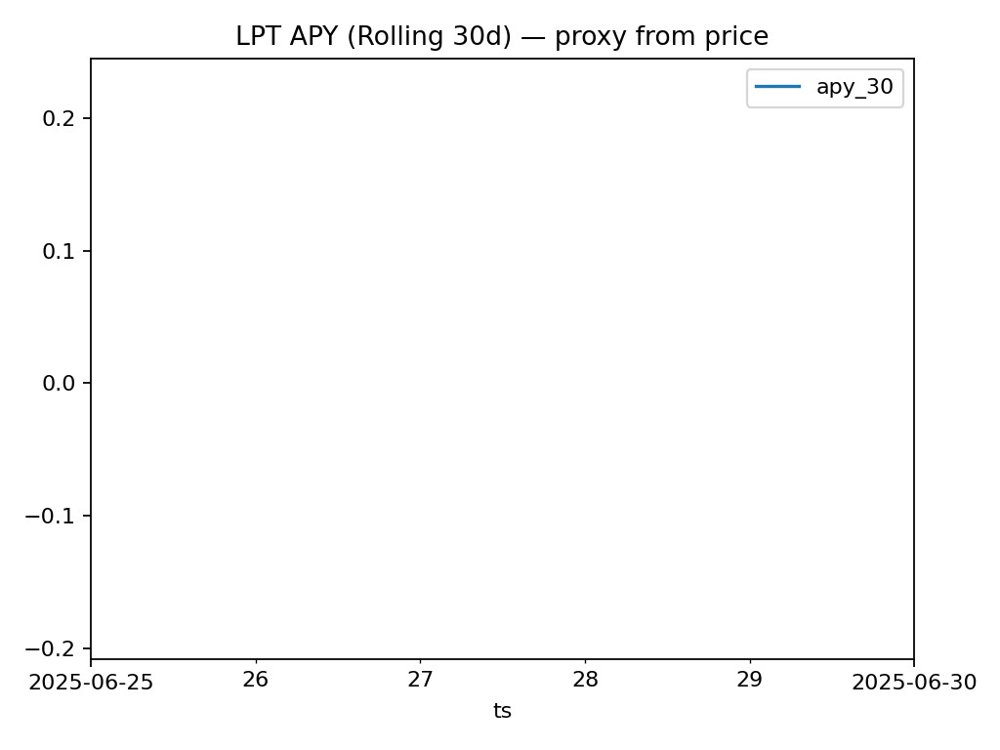
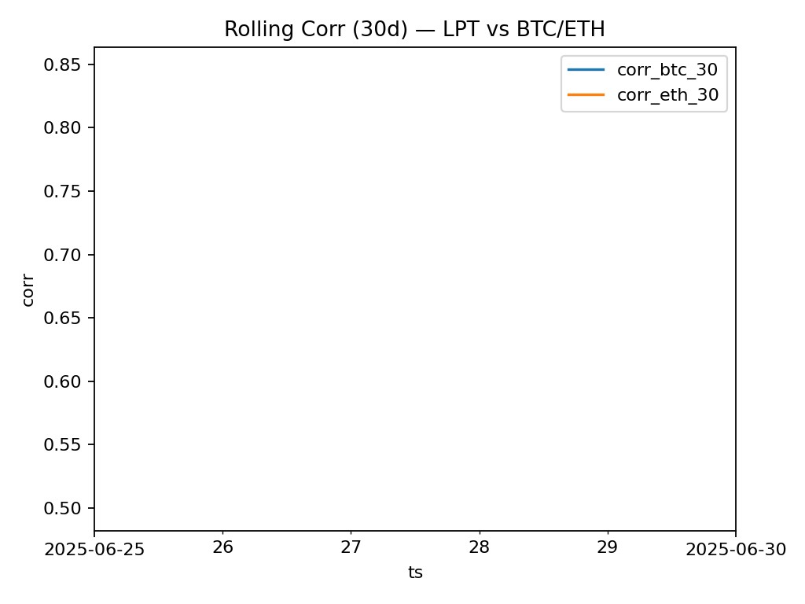
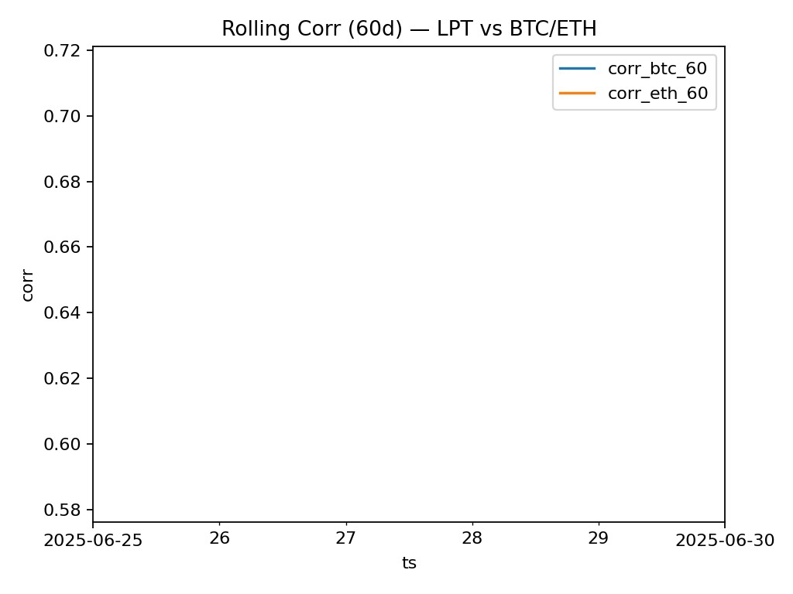

# 📊 Crypto AI Analytics  

Pipeline d’analyses quantitatives (LPT, AVAX, GMX) : netflows, APY, corrélations, usage, productivité.  
Objectif : fournir des visuels et des notes type analyste **prêtes pour un recruteur ou un investisseur**.  

---

## 🚀 Quickstart

```bash
# 1. Cloner le repo
git clone https://github.com/cryptopromptaiHAH/crypto-ai-analytics.git
cd crypto-ai-analytics

# 2. Créer un environnement Python
python -m venv .venv
.venv\Scripts\activate   # (Windows PowerShell)

# 3. Installer les dépendances
pip install -r requirements.txt

# 4. Lancer le pipeline LPT (90 jours par défaut)
$env:PYTHONPATH = "$PWD"
python src/lpt/lpt_pipeline.py --days 90
```

👉 Les résultats apparaissent dans :  
- `outputs/` (CSVs analysables)  
- `docs/img/` (graphes PNG exportés)  

---

## 📑 Reports
- `docs/top_netflow_zscore.md` → Top Netflow Z-Score Days  
- `docs/summary_2025-05_focus.md` → May–June 2025 Focus Summary  
- `docs/ANALYSE_LPT_MAI-JUIN-2025.md` → Detailed Analysis (May–June 2025)  

---

## Data Caching & Attribution

- **Caching**  
  Les prix / market cap / volumes sont mis en cache local dans `data/cache_<coin>_<vs>_<days>d.csv`.  
  - Premier run → fetch API + écriture cache  
  - Runs suivants (mêmes paramètres) → lecture cache (runs beaucoup plus rapides ⚡)  
  - Forcer un refresh → supprimer le fichier de cache correspondant ou relancer avec un autre `--days`.

- **API Key**  
  Créez un fichier `.env` à la racine avec :  
  ```bash
  COINGECKO_API_KEY=YOUR_API_KEY_HERE
  ```
> ⚠️ Ne partagez jamais votre clé API publique dans un dépôt GitHub.  
> Vous pouvez obtenir une clé gratuite sur [CoinGecko API](https://www.coingecko.com/en/api).

- **Attribution**  
  Data provided by [CoinGecko](https://www.coingecko.com/en/api).

---

✍️ **Author:** cryptopromptaiHAH  
📅 **Period analyzed:** May–June 2025  
## ?? Core charts (90d)







