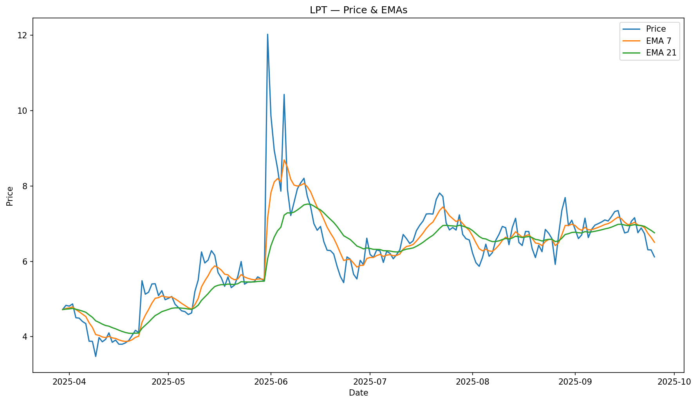
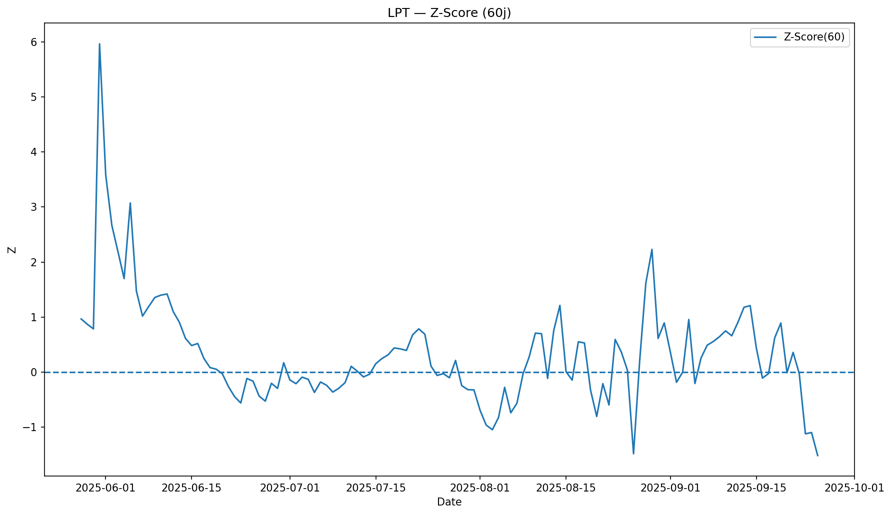

# Crypto AI Analytics — LPT Kit

Quantitative monitoring of **Livepeer (LPT)**: data downloads, technical indicators, exported charts, and automatic README updates.

---

## Overview

- **Data**: market history (Coingecko) over the selected window (default: 180 days).  
- **Indicators**:
  - Price + **EMA(20/50)**
  - **Z-Score** (local normalization)
  - **Correlation (rolling 60d)** vs **BTC** & **ETH**
- **Exports**: CSV in `data/` and PNG charts in `outputs/`.
- **Strategic analysis** (PDF) included in `docs/`.

---

## Results — LPT (last 180 days, vs USD)

### Price & EMA(20/50)

### Z-Score (local normalization)

### Correlation (60d) — vs BTC & ETH

