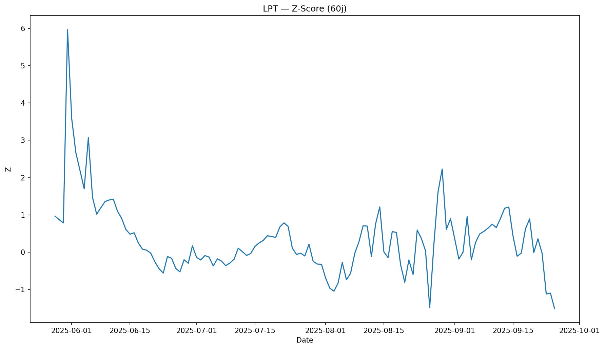

# Crypto AI Analytics — LPT Kit

Quantitative monitoring of **Livepeer (LPT)**: data downloads, technical indicators, exported charts, and automatic README updates.

---

## Quickstart

Clone the repository and install dependencies:

```bash
git clone https://github.com/cryptopromptaiHAH/crypto-ai-analytics.git
cd crypto-ai-analytics
pip install -r requirements.txt
```

---

## Overview

- **Data**: market history (Coingecko) over the selected window (default: 180 days).  
- **Indicators**:
  - Price + **EMA(20/50)**
  - **Z-Score** (local normalization)
  - **Correlation (rolling 60d)** vs **BTC** & **ETH**
- **Exports**: CSV in `data/` and PNG charts in `outputs/`.
- **Strategic analysis** (PDF) included in `docs/`.

---

## Results — LPT (last 180 days, vs USD)

### Price & EMA(20/50)


### Z-Score (local normalization)


### Correlation (60d) — vs BTC & ETH


---

## Pedagogical Note

This kit automatically generates:

- **CSV**: `data/lpt_market_180d.csv`  
- **Charts**:  
  `outputs/lpt_price_ema.png`, `outputs/lpt_zscore.png`, `outputs/lpt_corr.png`  
- **README**: updated via `scripts/update_readme_lpt.py`

**Interpretation logic:**
- **EMAs** show short/medium-term trends and crossovers.  
- **Z-Score** highlights **extreme deviations** (relative over/undervaluation).  
- **60d correlation** measures **market beta exposure** (BTC/ETH), useful for diversification and sizing.  

> ℹ️ If a chart does not appear on GitHub:  
> check the **exact path**, **case sensitivity**, absence of **spaces**, and make sure the file is properly **committed** (`git add outputs/...`).  

---

### Strategic Analysis (PDF)

- **LPT Strategy – Context, Allocation Rules & Risk/Reward**  
  **[Download the analysis (PDF)](docs/lpt_analysis.pdf)**

*⚠️ Disclaimer: This analysis is provided for educational and informational purposes only.       It does not constitute financial, investment, or trading advice.  
Do your own research and consult a professional before making investment decisions.*

---

### Reproduce Locally

```bash
# 1) Generate assets (180 days vs USD)
python scripts/generate_lpt_assets.py --days 180 --vs usd

# 2) Update the README automatically
python scripts/update_readme_lpt.py 180 usd
```