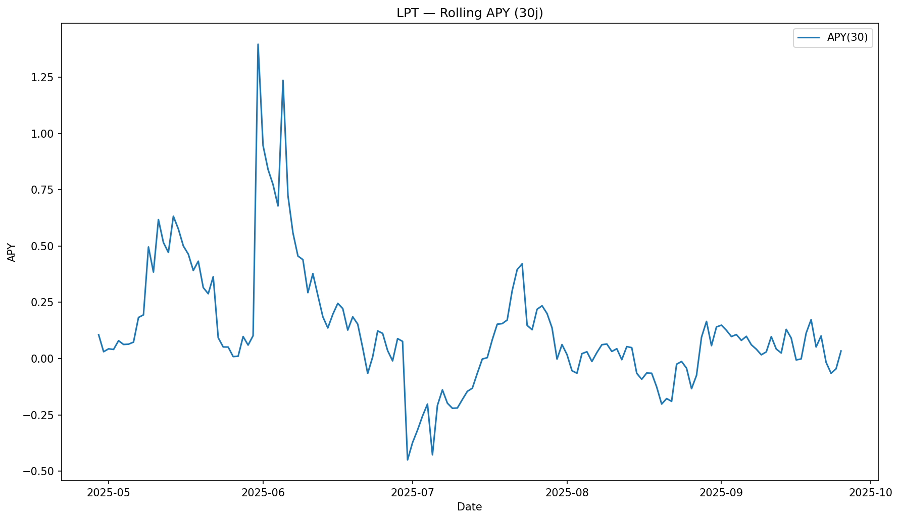

## 📈 Core charts (90d)

---

<!-- LPT-ASSETS:START -->
## LPT — Graphes (auto-générés)

*Dernière mise à jour (UTC): **2025-09-25***

**Price & EMAs**

**Z-Score (60j)**

**Rolling APY (30j)**

<!-- LPT-ASSETS:END -->
