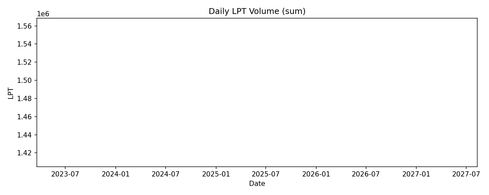
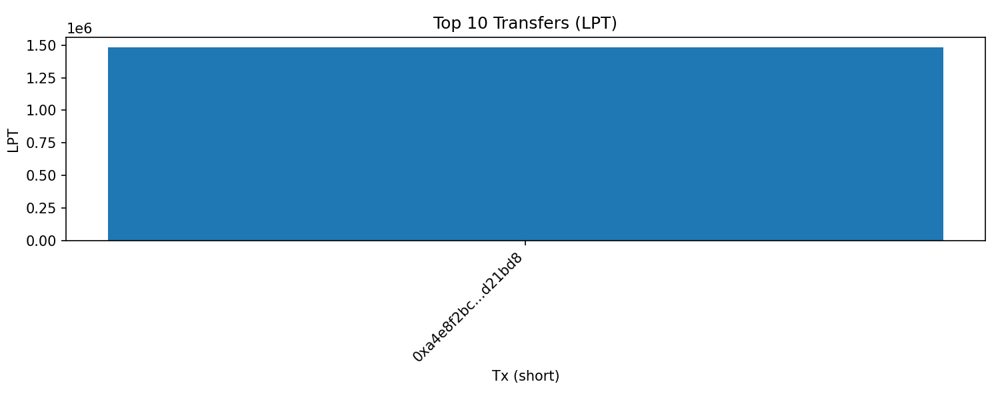
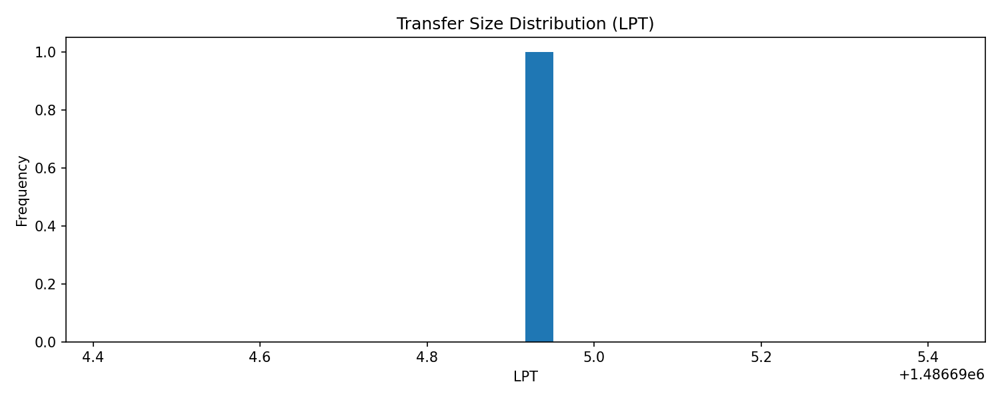
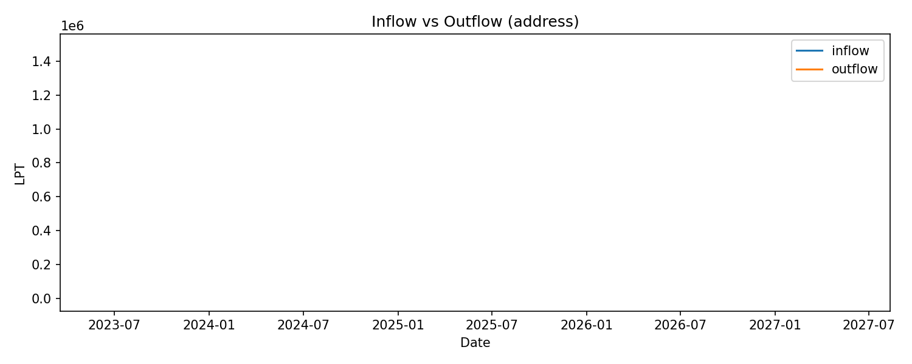
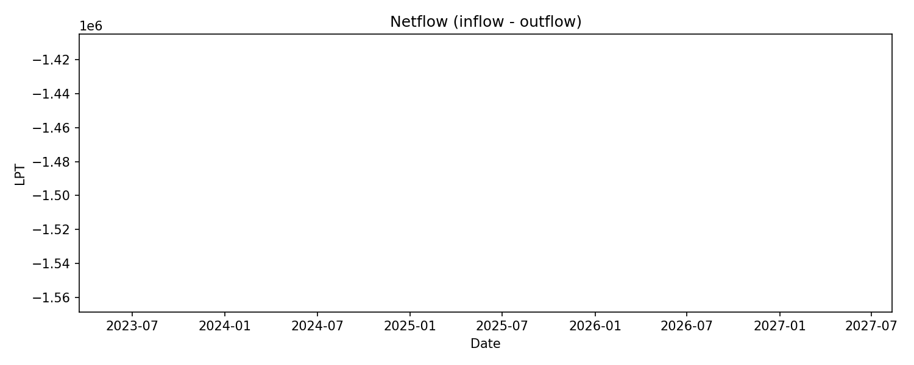

# LPT Transfers Summary (2025-05-20 → 2025-06-05)

- **Rows**: 1
- **Total Volume (LPT)**: 1,486,694.92
- **Max Transfer (LPT)**: 1,486,694.92
- **Address focus**: `0xF977814e90dA44bFA03b6295A0616a897441aceC` (in/out/netflow)

---

## Notes
- Daily volume = somme des transferts LPT par jour (toutes directions).
- Inflow = vers l’adresse; Outflow = depuis l’adresse; Netflow = In - Out.

