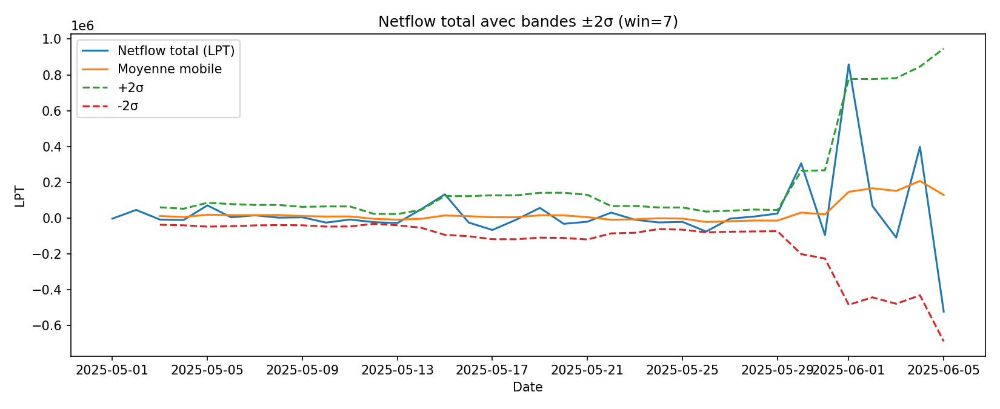
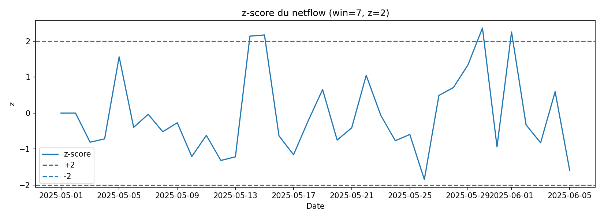

# Top-k jours de netflow (par |z|)

## Total

| date                | netflow   | zscore   |
|---------------------|-----------|----------|
| 2025-05-30 00:00:00 | 305911    | 2.36929  |
| 2025-06-01 00:00:00 | 858499    | 2.25837  |
| 2025-05-15 00:00:00 | 132664    | 2.17583  |
| 2025-05-14 00:00:00 | 49814.6   | 2.14353  |
| 2025-05-26 00:00:00 | -75224.2  | -1.84888 |
| 2025-06-05 00:00:00 | -522499   | -1.59339 |
| 2025-05-05 00:00:00 | 711444    | 1.56656  |
| 2025-05-29 00:00:00 | 25481.1   | 1.34198  |
| 2025-05-12 00:00:00 | -22622.3  | -1.31791 |
| 2025-05-13 00:00:00 | -27784.8  | -1.21732 |

---

## Par exchange

| date                | exchange  | netflow   | zscore   |
|---------------------|-----------|----------:|---------:|
| 2025-05-30 00:00:00 | binance14 | 629661    | 2.44369  |
| 2025-05-15 00:00:00 | binance14 | 751542.2  | 1.97285  |
| 2025-05-05 00:00:00 | binance14 | 109146    | 1.94032  |
| 2025-06-01 00:00:00 | binance14 | 825407.7  | 1.81965  |
| 2025-05-14 00:00:00 | binance14 | 148786.6  | 1.57623  |
| 2025-05-26 00:00:00 | binance14 | -158454.5 | -1.41613 |
| 2025-05-29 00:00:00 | binance14 | 51321.8   | 1.31383  |
| 2025-05-12 00:00:00 | binance14 | -48919.9  | -1.19874 |
| 2025-05-13 00:00:00 | binance14 | -52362.4  | -1.18366 |
| 2025-06-05 00:00:00 | binance14 | -168822.6 | -1.14528 |

---

## 📊 Visualisations

### Netflow avec bandes de z-score

### Z-score des anomalies détectées

